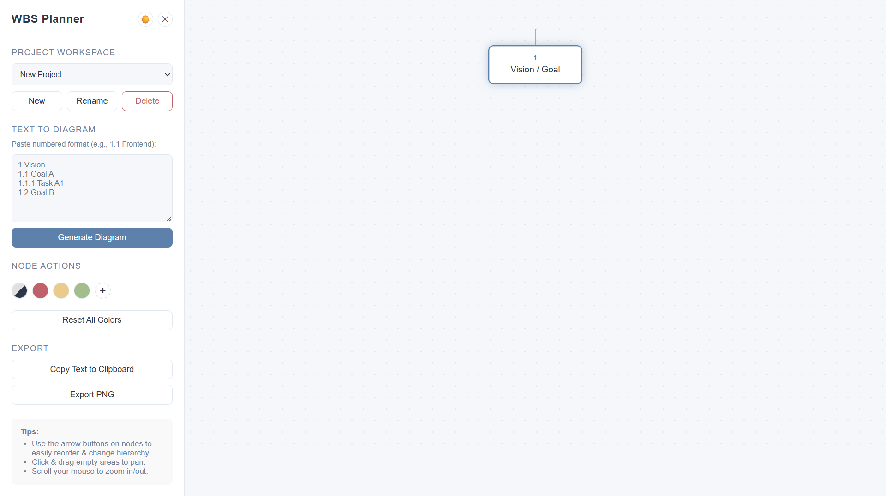
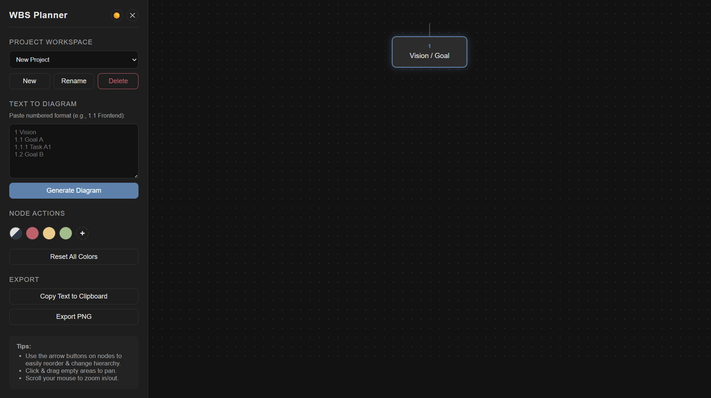

# WBS Visual Planner
**[🚀 Live Demo / Play Here](https://my-wbs-planner.vercel.app/)**

A clean, interactive, and lightweight web application for creating Work Breakdown Structures (WBS) and hierarchical visual mind maps. Built entirely with Vanilla JavaScript, HTML, and CSS (no frameworks). Designed for personal life planning, deep thinking, and breaking down large projects into manageable, auto-numbered tasks.

## ✨ Features

### 🌳 Core Diagramming
*   **Interactive Tree Hierarchy:** Visual node-based diagram that automatically connects parent and child tasks.
*   **Auto-Numbering:** Dynamic hierarchy numbering (e.g., `1`, `1.1`, `1.1.2`).
*   **Node Controls:** Easily add, edit (inline text editing), and delete nodes.
*   **Smart Positioning:** Reorder nodes effortlessly using intuitive hover controls (Move Up, Move Down, Indent/Make Child, Outdent/Make Sibling).
*   **Collapsible Nodes:** Expand or collapse branches to focus on specific parts of your project.

### 🎨 Customization & UI/UX
*   **Modern Dark/Light Mode:** Toggle between a calming dark theme and a clean light theme.
*   **Canva-Style Color Palette:** Select custom border colors for specific nodes to categorize them visually. Add, remove, and apply colors directly from the sidebar.
*   **Infinite Canvas:** Pan (click & drag) and Zoom (scroll) to navigate large diagrams.
*   **Collapsible Sidebar:** Hide the sidebar for a distraction-free, full-screen view.

### 💾 Data Management & Export
*   **Local Storage Auto-Save:** All progress is automatically saved to your browser's local storage.
*   **Multiple Workspaces:** Create, rename, delete, and switch between multiple independent projects.
*   **Text-to-Diagram:** Paste a numbered text list (e.g., `1.1 Frontend`) to instantly generate a visual WBS diagram.
*   **Export to Text:** Convert your visual diagram back into a structured, numbered text format.
*   **Export to PNG:** Download a high-quality snapshot of your diagram (powered by html2canvas).

## 🚀 Tech Stack
*   **HTML5**
*   **CSS3** (CSS Variables, Flexbox)
*   **Vanilla JavaScript** (ES6+)
*   *External Library:* [html2canvas](https://html2canvas.hertzen.com/) (CDN - strictly for PNG export)

## 📦 How to Use

Since this project uses no build tools or frameworks, running it is incredibly simple:

1. Clone this repository:
       git clone https://github.com/YOUR_USERNAME/wbs-visual-planner.git
2. Navigate to the project folder.
3. Open `index.html` directly in your favorite web browser.
4. Start planning!

## 📂 File Structure

    📁 wbs-visual-planner
     ├── 📄 index.html    # Main HTML structure and UI layout
     ├── 📄 style.css     # Styling, themes, and canvas layout
     ├── 📄 script.js     # Core logic, state management, and rendering
     └── 📄 README.md     # Project documentation

## 💡 Text-to-Diagram Syntax
You can easily import existing plans by pasting text into the "Text to Diagram" input field using the following format:

    1 Main Vision
    1.1 Goal A
    1.1.1 Task A1
    1.1.2 Task A2
    1.2 Goal B

Click **Generate Diagram**, and the app will construct the visual tree automatically.

---
*Created by [Daibi](https://github.com/Daibisan)*